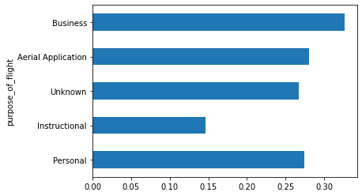
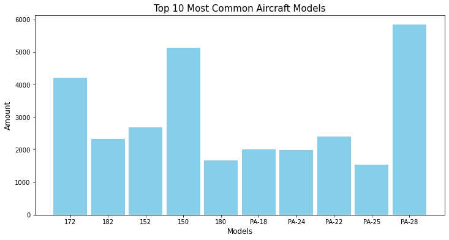
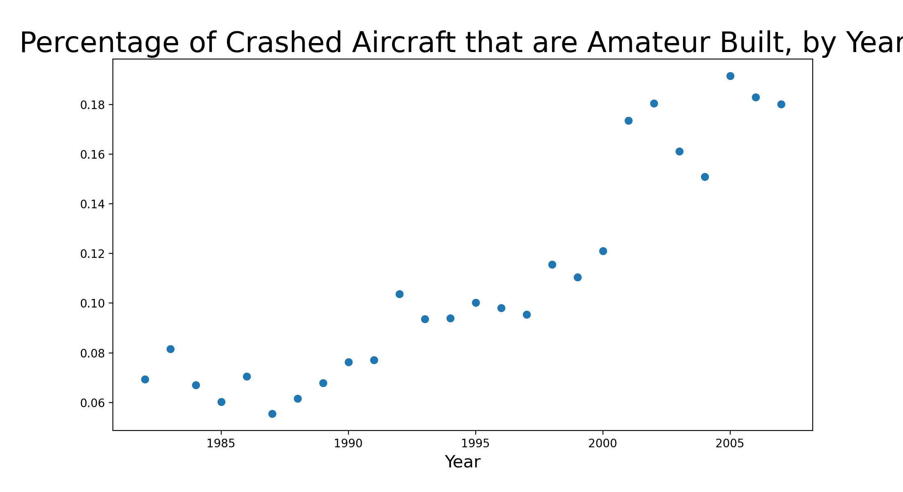

- [Problem Statement](#Problem-Statement)
- [Summary](#Summary)
- [Next Steps](#Next-Steps)
- [Data Dictionary](#Data-Dictionary)
- [External Resources](#External-Resources)

---

## Problem Statement

The Federal Aviation Administration (FAA) uses data from the National Transportation Safety Board 
(NTSB) to evaluate their regulations for civil aviation. The FAA hired our team of data scientists 
to analyze historic aircraft crash data from the NTSB and make predictions that will help them determine 
regulations for the future of aviation safety.

---

## Summary

To further examine this relationship, we ran logistic regression, support vector machine (SVM), and random forest models. 
For logistic regression, we used total major injuries, total minor injuries, total fatal injuries, total uninjuried,
and event month to predict aircraft damage level. The aircraft damage levels were assigned as 0 (minor), 1 (substantial), 
and 2 (destroyed).  For SVM and random forest model, we used weather condition and broad phase of flight to predict aircraft damage. 
After finding event month, weather condition, phases of flights are good variables used to predict aircraft damage. 
FAA might consider to enforce stricter policies to minimize aircraft damages.

After slicing the initial dataframe to include only the top ten makes, and then the top ten models,
we ran Random Forest and neural network multiclass classifiers to make predictions about the most
common models present in the NTSB crash data in the future. After finding that the Random Forest
classifier had significantly higher accuracy than the baseline model, we found that Piper PA-28
was predicted to be the most common model in future data.

Another facet of this dataset to explore was classifying between amateur and non-amateur-built aircraft. As we 
can see in the graph below, amateur built aircraft have represented a growing proportion of all accidents over 
time in our data set. Clearly this a growing community of enthusaists and the FAA would do well to prioritize
their safety.

In order to give my model enough data to work with, I first bootstrapped (random sampled with replacement) from
the positive class (amateur_built = 1) in order to get from the initial 91%/9% split to a more feasible 
60%/40% representation of the classes. Using this data, I was able to build a Random Forest model that predicted
whether an event involved an amateur built aircraft with 98% accuracy on training and 95% accuracy on test 
(unseen) data. Some of my most important positively correlated features included events that occurred during 
clear weather and more recent year values (as we would expect from the growing representation of amateur 
built craft). On the negative side, amateur built aircraft were less likely to be in play if the event was
in California or occurred during August or June.

---

### Recommendations

Damage prevention might be more cost effective than post damage response. FAA might consider to enforce stricter 
safety policies so that we can see fewer flight accidents. By implementing stricter safety policies, we believe 
we can drastically reduce the financial loss caused by damaged aircrafts, especially those destroyed ones. 

Additionally, given that the results of every model show that the Piper PA-28 aircraft is likely to remain 
the model most commonly seen in any crash data, the FAA would do well to make sure that, if the PA-28 is going 
to be used as a training aircraft, it is as safe as possible - perhaps stricter regulations for training aircraft 
or pre-training before actual flight.

Based on our data, roughly 10% of crash events in April involve amateur built aircraft, making it the second
highest month for the proportion of amateur built crashes throughout the year based on our data. The FAA should
designate April as "Amateur Builder Month" in order to better educate aviation enthusaists about the best methods
and safety measures for amateur aircraft construction. The FAA can partner with companies and organizations 
that sell approved build templates to promote awareness and safe practices among the members of this growing 
contingent.

---

### Next Steps

- Updating FAA regulations is an annual process - analyzing new crash data from NTSB annually
could help the FAA formulate new regulations and update existing ones.
- Developing a (legal) scraper to mine even more relevant data from NTSB’s online crash data library. 
- Refining models and increasing accuracy and F1 scores for all production models.

---

### Data Dictionary

|Feature|Type|Description|
|---|---|---|
|**event_id**|str|unique accident ID|
|**investigation_type**|str|categorical; Accident or Incident|
|**event_date**|time object|month/day/year of occurrence|
|**location**|str|City, State of occurrence|
|**country**|str|United States|
|**airport_code**|str|3-letter airport identifier|
|**airport_name**|str|name of airport|
|**injury_severity**|str|Fatal or Non-Fatal; if Fatal, number of deaths in ()|
|**aircraft_damage**|str|categorical; Substantial, Destroyed, or Minor|
|**aircraft_category**|str|categorical; Airplane, Helicopter, Glider, Balloon, Gyrocraft, Ultralight, Blimp, Powered-Lift, Unknown|
|**registration_number**|str|unique registration ID of aircraft|
|**make**|str|company or individual that produced the aircraft|
|**model**|str|model of aircraft|
|**amateur_built**|int|classification; 1 if yes, 0 if no|
|**number_of_engines**|int|number of aircraft engines; 0, 1, 2, 3 or 4|
|**engine_type**|str|categorical; Reciprocating, Turbo Shaft, Turbo Prop, Turbo Fan, Turbo Jet, Unknown|
|**far_description**|str|type of fare|
|**schedule**|str|categorical; UNK (unknown), NSCH (not scheduled), SCHD (scheduled)|
|**purpose_of_flight**|str|the trip's stated objective|
|**total_fatal_injuries**|int|quantity of fatal injuries (0 if none)|
|**total_serious_injuries**|int|quantity of serious injuries (0 if none)|
|**total_minor_injuries**|int|quantity of minor injuries (0 if none)|
|**total_uninjured**|int|quantity of uninjured passengers (0 if none)|
|**weather_condition**|str|level of damage to aircraft|
|**weather_condition**|str|categorical; VMC (visual meteorological conditions), IMC (instrument meteorological conditions), UNK (unknown)|
|**broad_phase_of_flight**|str|phase of flight when accident occurred|
|**publication_date**|str|date that accident report became available|

---

### External Resources
https://www.ntsb.gov/_layouts/ntsb.aviation/index.aspx  
https://www.faa.gov/about/history/timeline/
http://www.experimentalamateurbuiltaircraftmagazine.com/_media/img/small/t-bird-ii-experimental-amateurbuilt-aircraft012.jpg
http://www.experimentalamateurbuiltaircraftmagazine.com/_media/img/small/x-air-f-experimental-amateurbuilt-aircraft50.jpg
https://www.experimentalamateurbuiltaircraftmagazine.com/_media/img/small/t-bird-ii-experimental-amateurbuilt-aircraft004.jpg
https://i5.walmartimages.com/asr/6e2e3f9d-4e9f-4c2f-ad6e-4f4cdb0b8f7d_1.27b0e501f1b005b422505f963b5cbfb4.jpeg
https://en.wikipedia.org/wiki/Cessna_172
https://en.wikipedia.org/wiki/Piper_PA-28_Cherokee
https://docs.lib.purdue.edu/cgi/viewcontent.cgi?article=1042&context=jate
https://www.beasleyfirm.com/blog/2018/february/the-roles-of-the-faa-and-ntsb-in-plane-crashes/
https://www.faa.gov/documentLibrary/media/Order/FAA_Order_8100.19.pdf
https://www.google.com/search?sxsrf=ALeKk01303d_ZoUTujKBZI0R13aAJTvgYg%3A1605149702082&ei=BqSsX5bNBIHusQXv5Ji4Dw&q=how+much+does+u+lose+if+u+have+to+fix+damaged+aircraft&oq=how+much+does+u+lose+if+u+have+to+fix+damaged+aircraft&gs_lcp=CgZwc3ktYWIQAzoECCMQJzoFCCEQoAE6BQghEKsCOgcIIRAKEKABUKdSWIlcYLBeaABwAXgAgAGMAYgB0QiSAQMyLjiYAQCgAQGqAQdnd3Mtd2l6wAEB&sclient=psy-ab&ved=0ahUKEwiW6LbOgPzsAhUBd6wKHW8yBvcQ4dUDCA0&uact=5
https://www.faa.gov/regulations_policies/handbooks_manuals/aviation/helicopter_flying_handbook/media/hfh_ch13.pdf
https://www.avbuyer.com/articles/engines-biz-av/what-is-turboprop-engine-maintenance-112550
https://www.faa.gov/aircraft/gen_av/ultralights/amateur_built/kits/media/amateur_built_kit_listing.pdf
